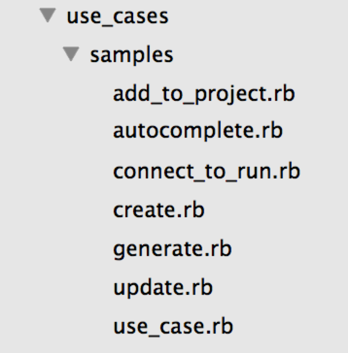

# 3 questions, every developer should answer to himself.

## How to write good code?
## How to test properly?
## How to improve existing code?

---

# *How to improve existing code?*

---

#Refactoring your rails app. One small trick with big impact.

##Ivan Nemytchenko, @inemation

### CTO, managing partner at JazzCloud

---

# Where to apply?

## Classical rails project
## Spontaneously taken decisions about where to put methods
## Long actions in controllers

---

First. Two rules

---

#Don't do it for free

---

#Don't push it too hard.

---

#Controllers' responsibility: responses & requests!


```ruby
  def create
    use_case = UseCases::Samples::Create.new(current_user, @project.id)
    @samples = use_case.run(params[:samples])
    render_results
  end

  def mass_update
    use_case = UseCases::Samples::Update.new(current_user, @project.id)
    use_case.run(params[:samples])
    render_results
  end
```

---

#Business logic - in use cases!




---

```ruby
  module UseCases::Samples
    class UseCase
      def initialize(initiator, project_id)
        @initiator = initiator
        @project_id = project_id
      end

      #All your hairy stuff here:
      def run(input_data)
        some_really_complex_stuff_here(input_data) do |data|
          b = @project.bla(data)
          c = initiator.blabla(project_id, data, b)
          bla!(initiator, project_id, c)
        end
      end

      private
      attr_accessor :initiator, :project_id

      def project
        @project ||= Project.find_by_id(project_id)
      end
    end
  end
```
---

* Try to keep it isolated
* Look for patterns
*

---

#Can I call one use case from anoher?

---


---
# Questions?

